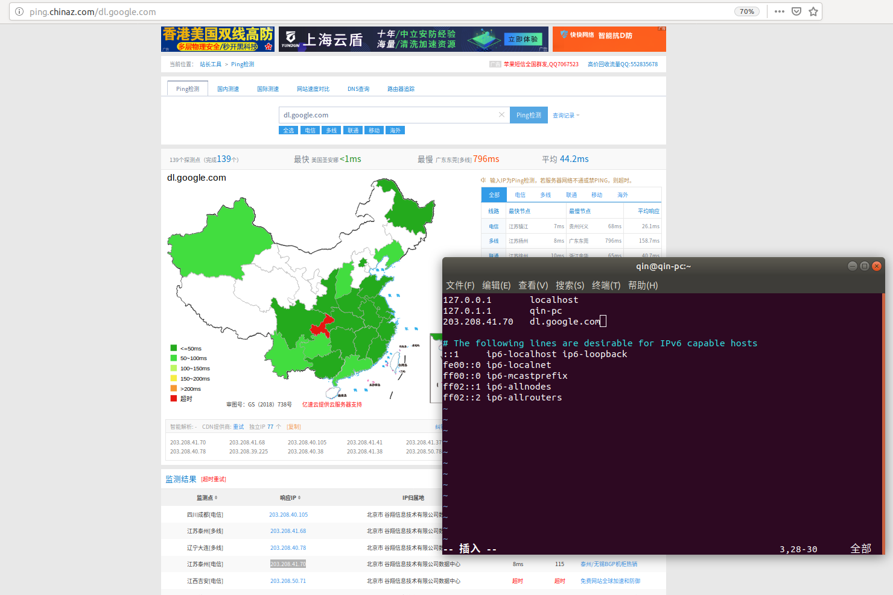

编译环境搭建
============

## 下载安装jdk

  - 下载地址:http://www.oracle.com/technetwork/java/javase/downloads/jdk8-downloads-2133151.html
  
  - 选择下载版本:jdk-8u111-linux-x64.tar.gz
  
  - 解压文件:
 
  ```
  tar -zxvf jdk-8u111-linux-x64.tar.gz
  ```
  - 重命名文件并移动到/usr/lib下面: 
 
  ```
  mv jdk1.8.0_111 /usr/lib/jdk8
  ```
  - 配置环境变量
  
  ```
  sudo vi /etc/profile
  ```
  - 添加以下几行
  
  ```   
  export JAVA_HOME=/usr/lib/jdk8
  export JRE_HOME=$JAVA_HOME/jre    
  export CLASSPATH=.:$JAVA_HOME/lib:$JRE_HOME/lib 
  export PATH=$JAVA_HOME/bin:$PATH 
  ```  
  - 使配置生效
  
  ```
  source /etc/profile
  ```
  - 验证是否配置成功
  
  ```
  java -version
  ```
  出现jdk版本信息，则配置成功
   
## 下载安装Android Studio
 
   - 下载地址:http://www.android-studio.org/
      - ```如果无法下载安装包，可以通过在http://ping.chinaz.com/网站输入dl.google.com找到可用的ip(一般谷翔的都还好)，然后在sudo vim /etc/hosts中添加，如图```
      
   
   - 选择下载版本:android-studio-ide-145.3360264-linux.zip
   
   - 解压到/opt:
   
   ```
   unzip android-studio-ide-145.3360264-linux.zip
   mv android-studio /opt
   ```
   - 运行
   
   ```
   chmod 777 android-studio
   vim android-studio/bin/studio.sh
   ##在第一行添加JAVA_HOME="/usr/bin/jdk8"以防止运行时提示找不到jdk路径
   ./android-studio/bin/studio.sh
   ```
   - 配置SDK
   - ```如果无法下载sdk，可以通过在http://ping.chinaz.com/网站输入dl.google.com找到可用的ip，然后在sudo vim /etc/hosts中添加，图片请见android studio下载```
       
    - 选择SDK Manager，下载android5.1版本
    - 安装 SDK Platform-Tools
    - 安装 Android SDK Tools
    - 配置环境变量
   
   ```
   sudo vi /etc/profile
   export PATH=$PATH:/opt/Android/Sdk/tools:/opt/Android/Sdk/platform-tools
   ```
    - 验证是否成功
   
   ```
   android list target
   ```
   能够查看到android5.1版本对应的id
   
   ```
   sudo apt-get install lib32z1 lib32ncurses5  lib32stdc++6
   ```

## 安装ANT
```
sudo apt-get install ant
```

## 安装uiautomatorviewer
- 目前做自动化测试是通过uiautomatorviewer来识别控件的
- 由于ubuntu自带的adb和apt中的uiautomatorviewer版本较低，因此android8.0之后需要用SDK中的工具
   - 当测试设备的android版本低于8.0:
     ```
     sudo apt insatll uiautomatorviewer
     ```
   - 当测试设备的android版本高于等于8.0，：
     ```
     vim ~/.bashrc
     ```
     在末尾加上
     ```
     alias adb='/home/qin/Android/Sdk/platform-tools/adb'
     alias uiautomatorviewer='/home/qin/Android/Sdk/tools/bin/uiautomatorviewer'
     ```
- 连接设备:adb connect ...
- 启动uiautomatorviewer
     ```
     uiautomatorviewer
     ```
   - 如果提示：Failed to load module "canberra-gtk-module"，就安装缺少的模块：
     ```
     sudo apt-get install libcanberra-gtk-module
     ```
- 点击uiautomatorviewer中的Device Screenshot按钮就可以获取控件信息
